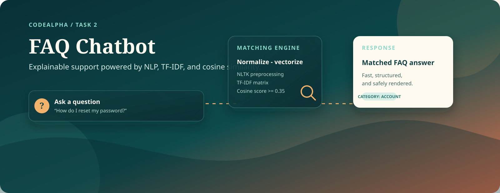
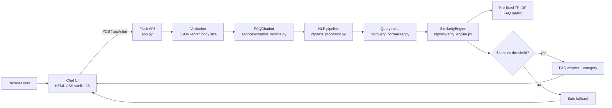
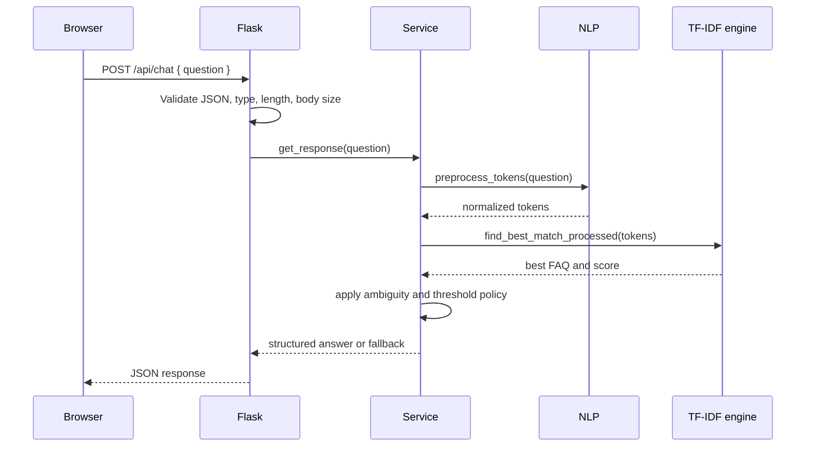

# CodeAlpha FAQ Chatbot

<p align="center">
  
</p>

<p align="center">
  <strong>Deterministic FAQ support for an online learning platform.</strong><br />
  Flask API, NLTK preprocessing, TF-IDF retrieval, cosine similarity, and a responsive vanilla JavaScript chat UI.
</p>

<p align="center">
  <a href=".github/workflows/tests.yml"></a>
  
  
  
</p>

> CodeAlpha Artificial Intelligence Internship, Task 2. The chatbot answers from a curated FAQ dataset; it does not generate knowledge or use an LLM.

## What This Project Does

The application turns a user question into a normalized text representation, compares it with 30 FAQ questions, and returns an answer only when the best cosine similarity score reaches the configured confidence threshold.

That design keeps the system fast, inspectable, and easy to test:

- **Input safety:** validates JSON, question type, length, and request size.
- **Consistent language processing:** applies the same NLTK pipeline to FAQ questions and user queries.
- **Explainable retrieval:** uses a pre-fitted scikit-learn TF-IDF matrix and cosine similarity.
- **Conservative answering:** rejects ambiguous, unrelated, and low-confidence questions with a fallback.
- **Browser experience:** provides history, retry, timeout handling, health status, and responsive layouts.

## Live Locally

```powershell
# Create the environment
python -m venv venv
.\venv\Scripts\Activate.ps1

# Install dependencies
pip install -r requirements.txt

# Start the server
flask --app app run
```

Open `http://127.0.0.1:5000/`.

To run beside another Flask project, use another port:

```powershell
flask --app app run --host 127.0.0.1 --port 5001
```

The first startup may download the NLTK resources listed in [NLP resources](#nlp-resources). This is a one-time startup task, not a per-request operation.

### Vercel deployment

The repository includes [api/index.py](api/index.py) and [vercel.json](vercel.json) for Vercel's Python serverless runtime. Import-time startup uses a deterministic portable NLP path on Vercel so cold starts do not depend on downloading NLTK corpora into an ephemeral function filesystem.

In Vercel, set `SECRET_KEY` to a strong project secret and redeploy from the `main` branch. The application entrypoints are:

- `/` - chat interface
- `/api/health` - deployment health check
- `/api/chat` - FAQ query endpoint

## Architecture



### Responsibilities by layer

| Layer | Owns | Key files |
| --- | --- | --- |
| Presentation | Accessible chat layout, history, retry, loading, status | [templates/index.html](templates/index.html), [static/css/style.css](static/css/style.css), [static/js/script.js](static/js/script.js) |
| HTTP boundary | Routes, request validation, error contract, security headers | [app.py](app.py) |
| Service policy | Dataset validation, threshold decision, fallback behavior | [services/chatbot_service.py](services/chatbot_service.py) |
| NLP | Contractions, phrase rules, tokenization, stop words, lemmatization | [nlp/text_processor.py](nlp/text_processor.py), [nlp/query_normalizer.py](nlp/query_normalizer.py) |
| Retrieval | TF-IDF fit at startup, vector transform, cosine scoring | [nlp/similarity_engine.py](nlp/similarity_engine.py) |
| Knowledge | 30 FAQ records across 12 validated categories | [data/faqs.json](data/faqs.json) |

### Request lifecycle



## Matching Pipeline

```text
Raw question
  -> lowercase and expand contractions
  -> replace domain phrases
  -> clean and tokenize
  -> remove stop words
  -> verb-aware lemmatization
  -> normalize domain tokens
  -> reject fewer than two content tokens
  -> transform with fitted TF-IDF vectorizer
  -> calculate cosine similarity
  -> accept at threshold or return fallback
```

The vectorizer is fitted once against the FAQ corpus during application startup. Requests only transform their normalized query and compare it with the in-memory FAQ matrix.

The default threshold is `0.35`. It is a similarity score, not a probability: a score of `0.80` does not mean an 80% chance that an answer is correct.

## API

### `GET /api/health`

```json
{
  "status": "ok",
  "message": "FAQ Chatbot API is running"
}
```

### `POST /api/chat`

```powershell
curl.exe -X POST http://127.0.0.1:5000/api/chat `
  -H "Content-Type: application/json" `
  -d "{\"question\":\"How can I reset my password?\"}"
```

Successful match:

```json
{
  "matched": true,
  "faq_id": 1,
  "answer": "Click 'Forgot password' on the login page, enter your registered email address, and follow the reset link we send you to create a new password.",
  "score": 1.0,
  "category": "Account"
}
```

No confident match uses the same success shape with `matched: false`, `faq_id: null`, and `category: null`. Error responses consistently use `{"error": "..."}`.

<details>
<summary>Supported error cases</summary>

| Situation | Status |
| --- | ---: |
| Missing or malformed JSON | 400 |
| JSON is not an object | 400 |
| Missing, non-string, or empty question | 400 |
| Question exceeds the configured limit | 400 |
| Request body exceeds the configured limit | 413 |
| Unknown API route | 404 |
| Unsupported API method | 405 |
| Unexpected processing failure | 500 |

</details>

## Frontend Experience

The frontend is deliberately dependency-free and has no build step.

- Conversation history is stored locally under `faq_chatbot_history` and capped at 100 messages.
- Dynamic user and server content is rendered with `textContent`.
- A 15-second `AbortController` timeout prevents stuck requests.
- Failed requests offer a retry action without duplicating the original user message.
- The new-chat dialog clears only this chatbot's local storage key.
- The health indicator checks `/api/health` on page load.

## Security Posture

The project includes application-level defensive controls:

- 500-character question limit and 16 KB request-body limit by default.
- No `eval`, `exec`, shell execution, SQL, or template execution paths.
- Safe generic client errors with detailed server-side logging.
- `X-Content-Type-Options`, `X-Frame-Options`, `Referrer-Policy`, and same-origin CSP headers.
- Unknown request fields are ignored.
- Dataset and configuration failures stop startup clearly instead of creating a partially initialized bot.

This is not a substitute for production infrastructure controls. A real deployment still needs HTTPS, a strong `SECRET_KEY`, rate limiting, dependency patching, monitoring, and a production WSGI server.

## Configuration

Copy `.env.example` to `.env` and adjust values as needed:

| Variable | Default | Purpose |
| --- | ---: | --- |
| `FLASK_DEBUG` | `0` | Enable the development debugger; keep disabled in deployment |
| `SECRET_KEY` | development placeholder | Replace before deployment |
| `SIMILARITY_THRESHOLD` | `0.35` | Minimum accepted cosine similarity, from 0 to 1 |
| `FAQ_MAX_QUESTION_LENGTH` | `500` | Maximum question length in characters |
| `FAQ_MAX_CONTENT_LENGTH` | `16384` | Maximum request body size in bytes |

## Testing and Evaluation

Run the complete automated suite:

```powershell
pytest
pytest -v
```

Run the matching and performance utilities:

```powershell
python -m tests.evaluate_matching
python -m tests.evaluate_matching --scan
python -m tests.evaluate_performance
```

The tests cover NLP normalization, similarity behavior, service policy, Flask API contracts, security payloads, dataset validation, reliability, and performance invariants. The fixed 40-query evaluation set currently reports **39/40 correct (97.5%)**, with zero false positives at the default threshold and one documented vocabulary-based wrong match. That result is a development evaluation, not a semantic-understanding guarantee.

<details>
<summary>Test map</summary>

| Area | Test modules |
| --- | --- |
| NLP and retrieval | `test_nlp.py`, `test_query_normalizer.py`, `test_similarity.py` |
| Service behavior | `test_confidence.py`, `test_reliability.py` |
| Flask integration | `test_app.py`, `test_chat_api.py` |
| Security | `test_security.py` |
| Evaluation regression | `test_evaluation.py` |
| Performance invariants | `test_performance.py` |
| Dataset contract | `test_faq_dataset.py` |

</details>

## NLP Resources

The application checks for and downloads these NLTK resources on first startup when they are missing:

- `punkt_tab`
- `stopwords`
- `wordnet`
- `omw-1.4`

For restricted or offline environments, install them through the NLTK downloader before starting the application.

## Project Structure

```text
CodeAlpha_FAQ_Chatbot/
|-- app.py
|-- data/faqs.json
|-- nlp/
|   |-- query_normalizer.py
|   |-- similarity_engine.py
|   `-- text_processor.py
|-- services/chatbot_service.py
|-- templates/index.html
|-- static/
|   |-- css/style.css
|   `-- js/script.js
|-- tests/
|   |-- data/matching_evaluation.json
|   |-- evaluate_matching.py
|   |-- evaluate_performance.py
|   `-- test_*.py
|-- docs/
|   |-- assets/faq-chatbot-banner.svg
|   `-- PHASES.md
|-- requirements.txt
|-- pytest.ini
`-- .github/workflows/tests.yml
```

## Design Decisions and Limits

<details>
<summary>Why classical NLP?</summary>

TF-IDF and cosine similarity keep this project local, fast, explainable, and inexpensive to run. The trade-off is vocabulary sensitivity: semantically equivalent wording can still be missed when it shares too little vocabulary with the FAQ corpus.

</details>

Known limits include a small 30-FAQ knowledge base, no conversation context during matching, no multilingual pipeline, and no semantic embeddings or LLM fallback. The browser history is display-only and is never stored on the server.

## Roadmap

1. Expand the curated FAQ dataset and add unanswered-question analytics.
2. Add browser-level tests for responsive UI and localStorage workflows.
3. Evaluate an optional semantic retrieval layer while retaining the deterministic fallback policy.
4. Add deployment documentation for a production WSGI server and HTTPS reverse proxy.

## Internship Context

This repository documents **CodeAlpha Artificial Intelligence Internship, Task 2 - Chatbot for FAQs**, developed by **Anmol Kumar**.

- GitHub: [AnmolKumar632](https://github.com/AnmolKumar632)
- Development notes: [docs/PHASES.md](docs/PHASES.md)

## License

No license file is currently included. Add a license before distributing the project publicly.
